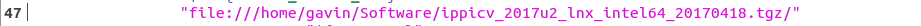
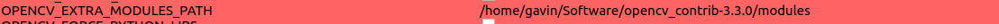
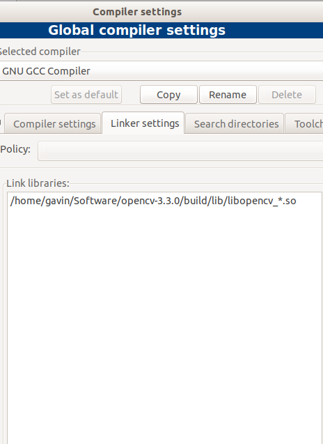
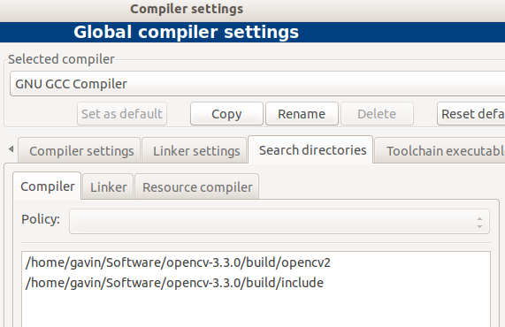
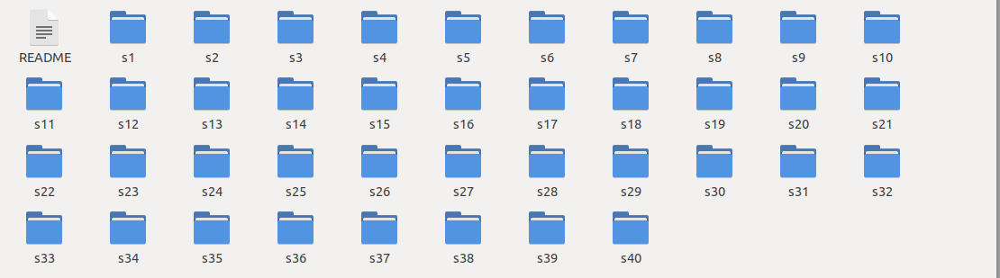
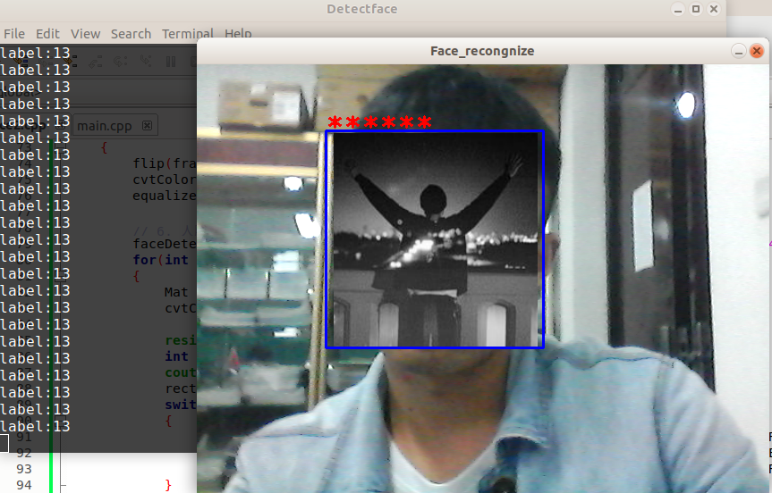

## OpenCv之人脸识别

#### OpenCv安装

​		本次选用版本为OpenCv3.3.0，也可以在OpenCv2.4.9中（**本人亲测可以，需要修改代码某些部分，但改动不大**），当然此次也安装了OpenCv3.3.0 contrib，因为需要使用其中的**face**库，来实现人脸识别的相应模块，在安装OpenCv3.3.0和OpenCv 3.3.0 contrib时，应该注意选则**相同的版本**，为加快开发速度，我已经将相应版本上传到网盘，可自行下载．（[百度网盘](https://pan.baidu.com/s/1r3gPDO1RCQfVj-g2njNosg) 密码：epww）在实际的安装过程需要注意一下几点：

1. **ippicv_2017u2_lnx_intel64_20170418.tgz的下载与放置问题？**

   ​	ippicv_2017u2_lnx_intel64_20170418.tgz压缩包不需要解压．下载后放在你指定的位置，接着修改**opencv-3.3.0/3rdparty/ippicv/ippicv.cmake**中位于**47**行的内容,将如下目录换成的下载文件的绝对路径．

   

2. **怎样安装OpenCv3.3.0 contrib？**

   ​		需要在Cmake-gui中找的如下一项，并且修改路径到你安装的OpenCv3.3.0 contrib路径下面，需要特别注意，需要将路径细化到modules文件下，否则如果指定到上一级目录，则会出现路径不存在．

   

3.  **是否需要安装全部的modules?**

   ​		modules不需要全部安装，modules下的每一个子库，都是一个单独的模块，可以进行筛选后，选择需要的模块进行安装，否则最后你会安装一个庞大的Opencv，当然，这也有利于我们移植．（个别模块除外）

#### CodeBlocks 环境搭建

​		本人因为使用的是CodeBlocks,所以选择了配置此编译器的环境，需要改动的地方只有一下两部分，只需要把编译好的OpenCv库和头文件链接到编译器中中即可，无需改动其他部分，如下图：

|  |  |
| :--------------------: | :--------------------------: |
|         链接库         |            头文件            |

#### 人脸检测

- **Haar特征**

  ​		Haar特征的基本原理就是认为不同区域的像素值是不同的，它是一种边界检测。比如说，对于人的眼睛和非眼睛区域，就十分的不同，以这个特征来作为一种检测的标准。Haar特征一共分为三类：线性特征、边缘特征、对角特征和中心特征，组合成特征模板，如下图：

  

  ​		从上图中可以看到在Haar特征模板中只有黑色和白色两种矩形，而对于每个特征模板的特征值的计算，一般是通过使用白色矩形框中的像素值的和减去黑色矩形框的像素值的和。但是，特别是在对C类特征模板进行计算时，需要把黑矩形框中的像素扩大一倍，这样可以保证黑色框的像素点数目和白色框中的像素点数目保持一致。所以，Haar特征很好的反映了图像中所存在的灰度的变化情况。其次，为了更好的区分人脸和非人脸，我们希望在人脸区域计算出来的特征值和非人脸区域计算出来的特征值，有明显的的差值。

  ​	在使用特征模板提取人脸特征时，为了获取大量的特征值，我们可以使用任意组合形状（拉长或缩放）的特征模板，并且可以在任意的位置对特征值进行计算，如下图：

​		

- **代码**

  ​		人脸识别的前提是需要在本地有一个真实的人脸数据库，当我们检测到真实的人脸后，会与本地人脸数据库进行对比，最终输出相应的身份信息，所以采集一个好的样本数据变得尤为重要．所以，在实际的采集过程中，要保证所有的人脸样本表情尽可能不一样，并且要保证所有图片中的眼睛在同一水平线上，这样能够有效的提高人脸识别的准确度．同时需要注意对图片进行相应的缩放，否则会出现大小不一致的问题．代码如下(<font color = red>需要注意，在引入Haar人脸检测的xml文件时，我使用的是opencv3.4.1，你需要修改到opencv3.3.0下面</font>)：

  ```c++
  #include<opencv2/opencv.hpp>
  #include<iostream>
  
  using namespace std;
  using namespace cv;
  
  string hear_face_datapath = "/home/gavin/Software/opencv-3.4.1/data/haarcascades/haarcascade_frontalface_alt.xml";
  
  int main()
  {
  
      VideoCapture cap(0);
      if(!cap.isOpened())
      {
          cout<< " 不能打开视频" << endl;
          return -1;
      }
      Size S = Size((int)cap.get(CV_CAP_PROP_FRAME_WIDTH), (int)cap.get(CV_CAP_PROP_FRAME_HEIGHT));
      int fps = cap.get(CV_CAP_PROP_FPS);
  
      CascadeClassifier faceDetect;
      faceDetect.load(hear_face_datapath);
      vector<Rect> faces;
      int count = 1;
  
      Mat frame, dst;
      namedWindow("camera", CV_WINDOW_AUTOSIZE);
  
      while(cap.read(frame))
      {
  
          flip(frame, frame,1);
          faceDetect.detectMultiScale(frame, faces, 1.1, 1, 0, Size(100, 120),Size(380, 400));
          //绘制人脸
          for (int i = 0; i<faces.size();i++)
          {
              if(count % 10 == 0)
              {
                  resize(frame(faces[i]), dst, Size(92, 112));
                  cout<<"存入图片！"<<endl;
                  imwrite(format("/home/gavin/C++progarmm/Detectface/faces2/face_%d.jpg", count),dst);//写入人脸
              }
  
              count += 1;
              rectangle(frame,faces[i], Scalar(0, 0, 255), 2, 8, 0);
          }
  
          imshow("camera", frame);
          char c = waitKey(100);
          if (c == 27)
          {
              break;
          }
          count += 1;
      }
      cap.release();
  
      return 0;6
  ```

#### 构建人脸数据库

​		人脸检测时需要读取本地的csv文件，OpenCv在contrib的face库中已经编写好了python，直接使用即可，需要注意该pyhon使用的是python2,所以执行时，需要使用python2运行该脚本，脚本路径：**opencv_contrib-3.3.0/modules/face/samples/etc**．

脚本代码如下：

```python
#!/usr/bin/env python

import sys
import os.path

# This is a tiny script to help you creating a CSV file from a face
# database with a similar hierarchie:
#
#  philipp@mango:~/facerec/data/at$ tree
#  .
#  |-- README
#  |-- s1
#  |   |-- 1.pgm
#  |   |-- ...
#  |   |-- 10.pgm
#  |-- s2
#  |   |-- 1.pgm
#  |   |-- ...
#  |   |-- 10.pgm
#  ...
#  |-- s40
#  |   |-- 1.pgm
#  |   |-- ...
#  |   |-- 10.pgm
#

if __name__ == "__main__":

    if len(sys.argv) != 2:
        print "usage: create_csv <base_path>"
        sys.exit(1)

    BASE_PATH=sys.argv[1]
    SEPARATOR=";"

    label = 0
    for dirname, dirnames, filenames in os.walk(BASE_PATH):
        for subdirname in dirnames:
            subject_path = os.path.join(dirname, subdirname)
            for filename in os.listdir(subject_path):
                abs_path = "%s/%s" % (subject_path, filename)
                print "%s%s%d" % (abs_path, SEPARATOR, label)
            label = label + 1
```

​		**需要注意**:你在把你挑选好的数据放入指定文件时，需要遵循该脚本需要的文件结构，可以使用orl_faces数据库，直接在下面建立一个文件夹，存放你采集的人脸照片(<font color = red>必须为同一个人的照片</font>)，下面是其文件结构，我创建文件夹**S39**：

- **文件夹结构**

  


#### 人脸识别

- **Eigenface**

  ​		在人脸识别方面，使用Eigenface(特征脸)来进行人脸的重新构建，Eigenface基本想法是使用PCA算法把一个高维度的数据转换到另一个低维度子空间，从而可以的到一张特征脸。而使用PCA数据降维的原因是在原始图像中由于视角、形状和光照角度的不同，会使得同一目标在视觉上有很大区别，使用另一个维度空间来描述原始图像能够很好实现区分效果，从而达到分类识别的效果。而在进行识别时，只需要把检测图片同样转换得到特征脸子空间，通过计算特征图到检测图片的距离来判断是否为同一个人。特征脸的训练与识别流程如下：

  （１）采集人脸数据

  （２）读取训练数据

  （３）（1） 计算平均脸。读取人脸数据库中某一人的M张图片人脸图片，每张图片转化为一个N维向量，然后把这M个向量放集合S中：。在获取到一个人脸向量的集合之后，计算平均图像，即该人的平均脸：计算公式如下:
  $$
  \psi=\frac{1}{M} \sum_{n-1}^{M} \Gamma_{n}
  $$
  （４）计算协方差矩阵。

  （５）计算特征值。

  （６） 特征矩阵。

  （７）PCA降维。

  （８）子空间模拟。

  （９）检测与识别。检测时使用Haar特征进行人脸检测，然后把检测到的人脸和训练时的人脸一起映射到特征向量的空间中进行对比。如果检测的人脸与数据库中的人脸相匹配，则验证成功，并且显示身份信息，否则验证失败。

- **代码**

  ```c++
  #include<opencv2/face/facerec.hpp>
  #include<iostream>
  #include<opencv2/opencv.hpp>
  
  using namespace cv;
  using namespace cv::face;
  using namespace std;
  string haar_face_datapath = "/home/gavin/Software/opencv-3.4.1/data/haarcascades/haarcascade_frontalface_alt2.xml";
  int main()
  {
      //1.打开人脸数据集
      string filename = string("/home/gavin/C++progarmm/Detectface/mylist.csv");
  
      ifstream file(filename.c_str(), ifstream::in);
      if(!file)
      {
          cout<< "Can't open!" <<endl;
          return -1;
      }
      string line, path, classlabel;
      vector<Mat> images;
      vector<int> labels;
      char separtor = ';';
  
      while(getline(file, line))
      {
          stringstream liness(line);
          getline(liness, path, separtor);
          getline(liness, classlabel);
          if(!path.empty()&&!classlabel.empty())
          {
              //cout<< "path:" << path.c_str()<<endl;
              images.push_back(imread(path, 0));//读取灰度图片
              labels.push_back(atoi(classlabel.c_str()));
          }
  
      }
      if(images.size()<1 || labels.size()<1)
      {
          cout<< "路径错误！" << endl;
          return -1;
      }
  
      int heigh = images[0].rows;
      int width = images[0].cols;
      //cout<< "Heigh:" << heigh << "\nWidth" << width <<endl;
      //2.创建测试样本
      Mat testsample = images[images.size()-1];
      int testlabel = labels[labels.size()-1];
      images.pop_back();
      labels.pop_back();
      //3.训练数据
      Ptr<BasicFaceRecognizer> model = EigenFaceRecognizer::create();
      model->train(images, labels);
      CascadeClassifier faceDetector;
      faceDetector.load(haar_face_datapath);
  
      //打开摄像头测试人脸
  	VideoCapture cap(0);
  	if(!cap.isOpened())
  	{
          cout<< "Can't open "<< endl;
          return -1;
  	}
  
      Mat frame;
      namedWindow("face_recongnize",CV_WINDOW_AUTOSIZE);
      vector<Rect> faces;
      Mat dst;
      Mat gray;
      while(cap.read(frame))
      {
          flip(frame, frame, 1);
          cvtColor(frame, gray,COLOR_BGR2GRAY);
          equalizeHist(gray,gray);
          faceDetector.detectMultiScale(gray, faces, 1.1, 4, 0, Size(80, 100), Size(380, 400));
          for(int i = 0;i < faces.size(); i++)
          {
              Mat roi = frame(faces[i]);
              cvtColor(roi, dst, COLOR_BGR2GRAY);
              resize(dst, testsample, testsample.size());
              int label = model->predict(testsample);
              cout<< "label:" << label << endl;
              rectangle(frame, faces[i], Scalar(255, 0, 0), 2, 8, 0);
              putText(frame, format("%s",(label == 13?"*****":"Unknow")), faces[i].tl(),FONT_HERSHEY_PLAIN, 2.0, Scalar(0, 2, 255), 2, 8);
          }
          imshow("face_recongnize", frame);
          char c = waitKey(10);
          if(c == 27)
          {
              break;
          }
      }
      waitKey(0);
      return 0;
  }
  ```

- **检测效果**

  

#### 总结

​		之前写过这个代码，这次刚好要用，发现许多地方的忘记了，导致我花费了好大时间才把它弄出来，真心不容易，所以把遇到的问题和一些关键的点写下来，下一次就好用多了．[github链接](https://github.com/Gavince/Face-recognition)

